# adaptive fuzzy sliding mode control

> Authors:	Seonghyeon Jo(cpsc.seonghyeon@gmail.com)
> 
> Date:		 Jan  20, 2022

This repository is a MATLAB simulation of  **adaptive fuzzy sliding mode control** for robot manipulator.  The robot manipulator uses sawyer 4-dof manipulator and prototype 3-dof manipulator. we compare to simple PID Controller, Sliding Mode Control(SMC), Fuzzy Silding Mode Control(FSMC), Adaptive Fuzzy Sliding Mode Control(AFSMC).

"Adaptive fuzzy sliding mode control using supervisory fuzzy control for
3 DOF planar robot manipulators."

#### Description of robot manipulator model

   In general, the dynamic of a robotic manipulator can be expressed as follows:

where $q, \dot{q}, \ddot{q}, \tau, \tau_d \in \mathcal{R}^{n}$ denote the joint position vector, velocity vector, acceleration, the vector of control torques, and the vector of disturbance torques, respectively, and $M\in\mathcal{R}^{n\times n}$ denotes the symmetric positive definite inertia matrix, $C \in \mathcal{R}^{n\times n}$ denotes the Coriolis matrix, $G \in \mathcal{R}^{n}$ denotes the gravity vector and $F$ is the friction matrix. 

   Multiplying $M^{-1}(q)$ by both sides in Equation (1), we have 

ddd

dddd

Control effort  equivalent control effort

## sawyer 4-dof manipulator

### RMSE 

|  Method  | joint 1 | joint 2 | joint 3 | joint 4 |  sum   |
| :------: | :-----: | :-----: | :-----: | :-----: | :----: |
|   PID    | 0.0394  | 0.0339  | 0.0044  | 0.0083  | 0.0860 |
| SMC-SIGN | 0.0078  | 0.0349  | 0.0003  | 0.0039  | 0.0469 |
| SMC-SAT  | 0.0078  | 0.0358  | 0.0004  | 0.0019  | 0.0460 |
|   FSMC   | 0.0111  | 0.0146  | 0.0017  | 0.0043  | 0.0317 |
|  AFSMC   | 0.0105  | 0.0141  | 0.0013  | 0.0042  | 0.0301 |

### Figure

#### pid controller
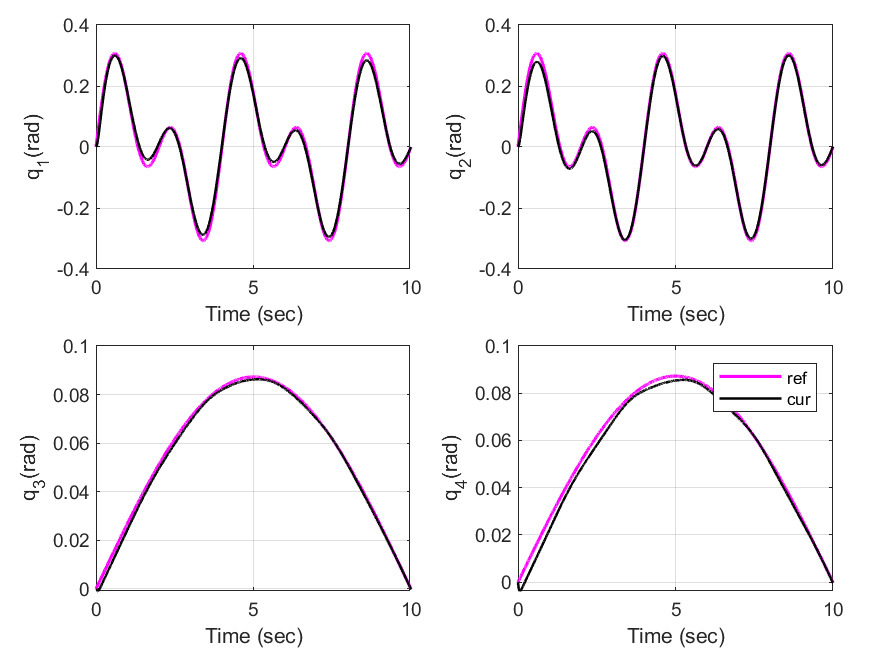
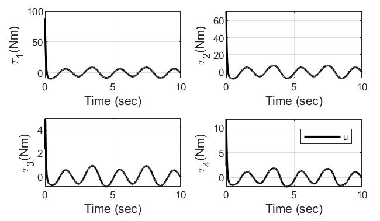
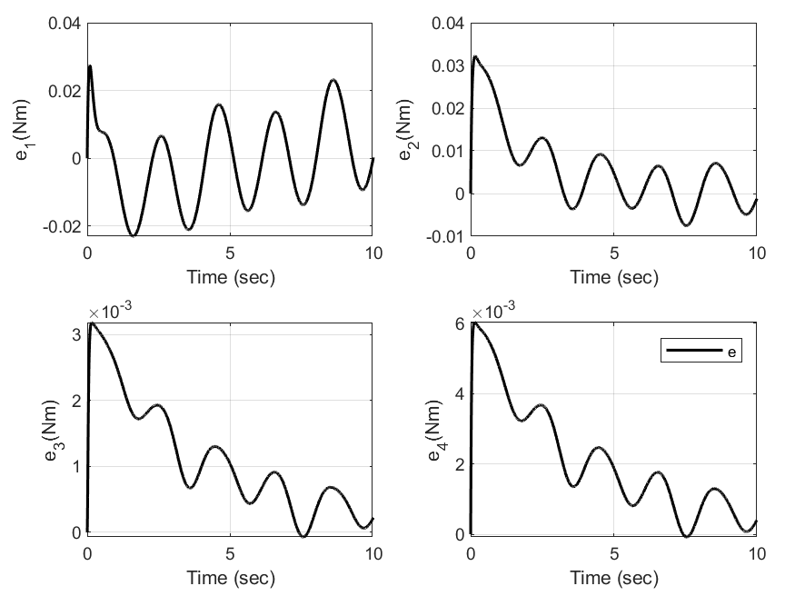

#### smc using sign function
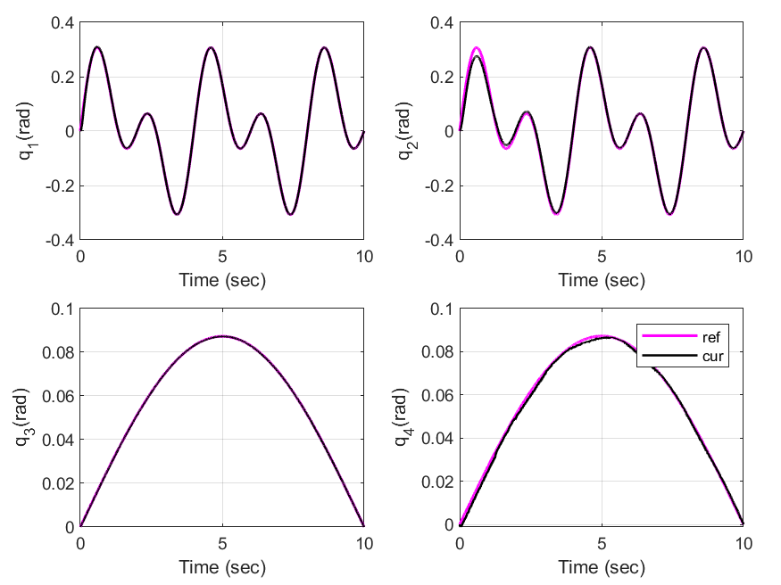
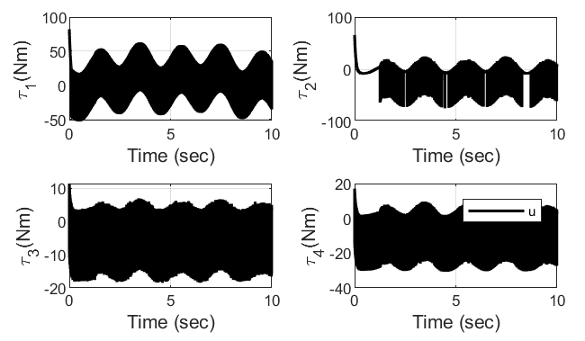

#### smc using sat function

#### smc using sat function
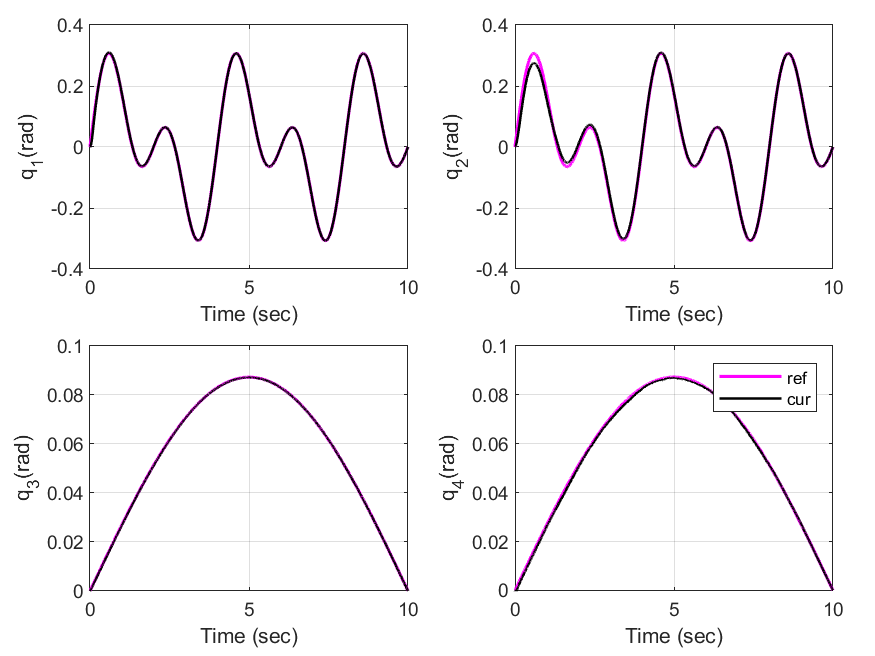
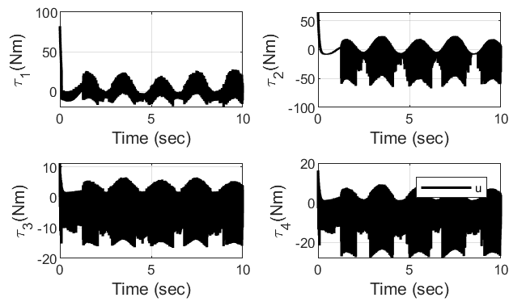
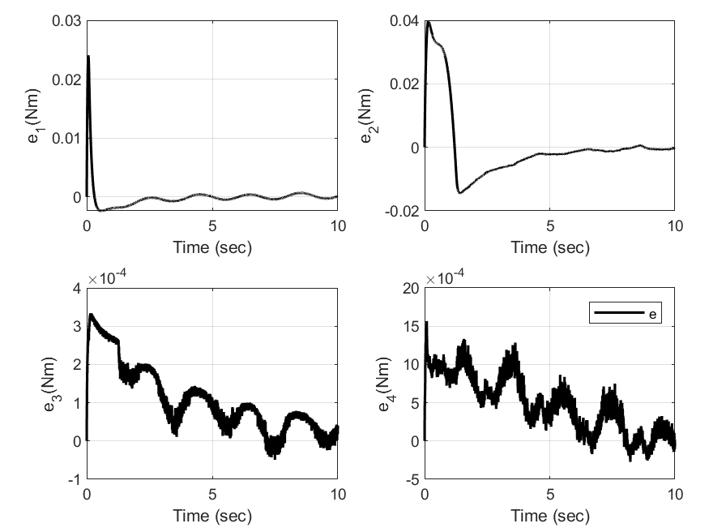

#### fsmc
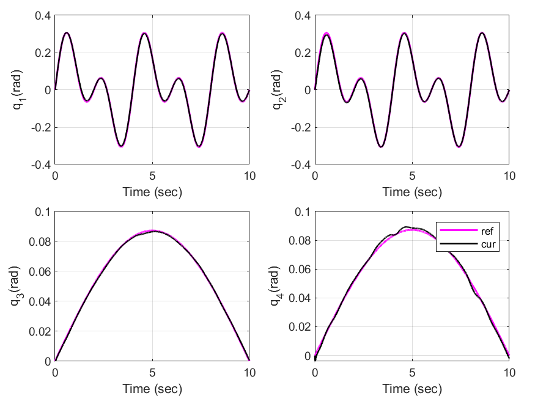
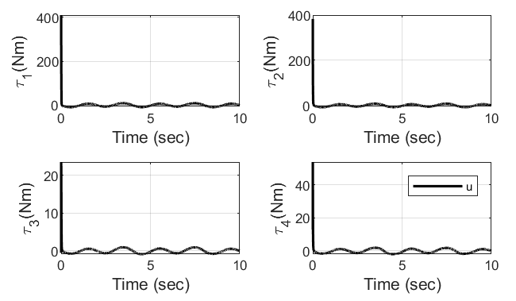
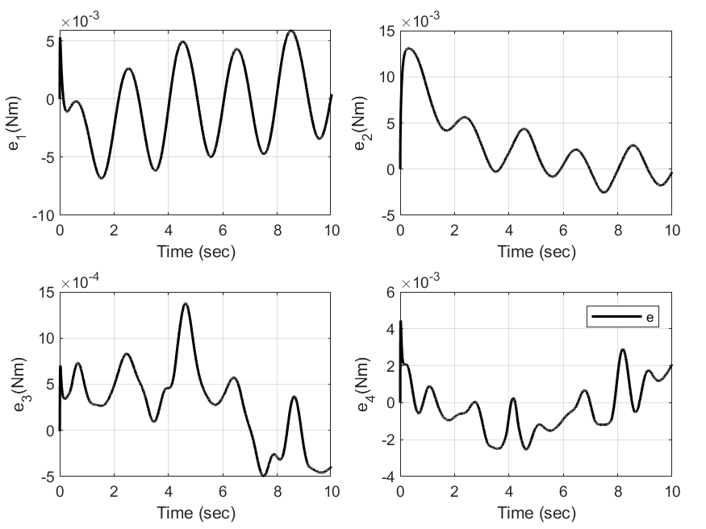

####  afsmc
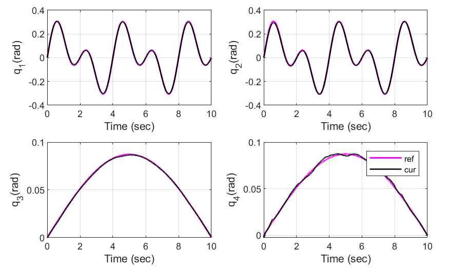
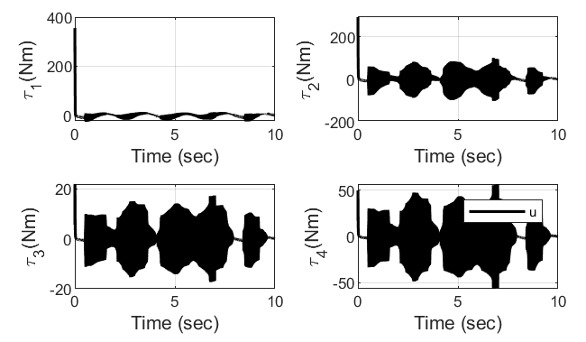
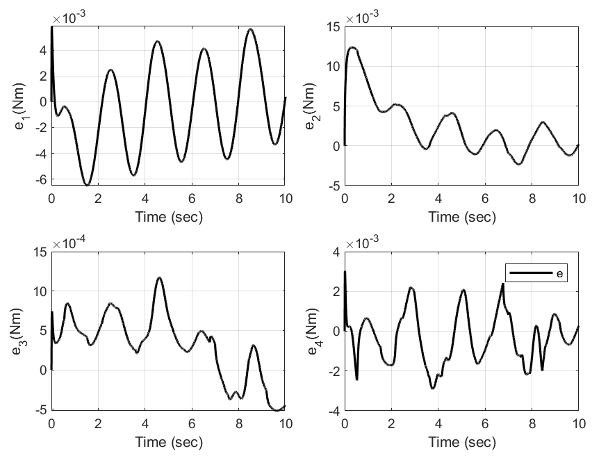

